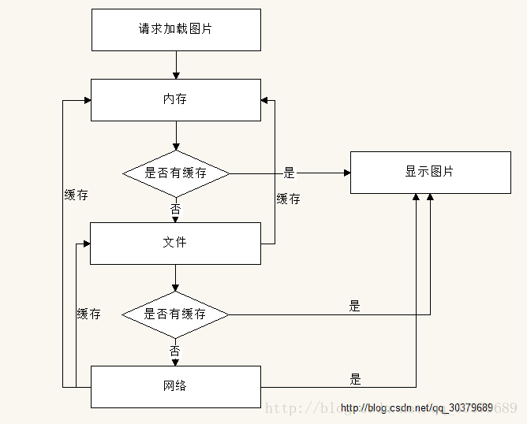
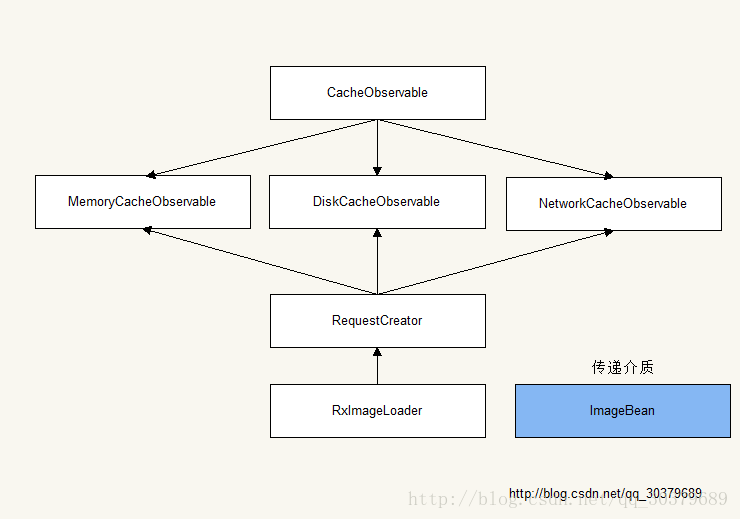

# RxImageLoader
RxJava2解锁图片三级缓存框架
简单地实验性了解图片加载的三级缓存与RxJava2结合之作

# 缓存流程图

1.内存缓存（一级）：如果内存存在我们的缓存信息，直接用它
2.文件缓存（二级）：如果内存不存在我们的缓存信息，那么就查看是否有我们的缓存文件，如果有，直接使用它。同时将其缓存到内存中
3.网络缓存（三级）：如果文件不存在缓存文件，直接从网络上下载，直接使用它。同时，将其缓存到文件和内存中

# 项目架构

[详细说明链接](https://blog.csdn.net/qq_30379689/article/details/69525462) 
